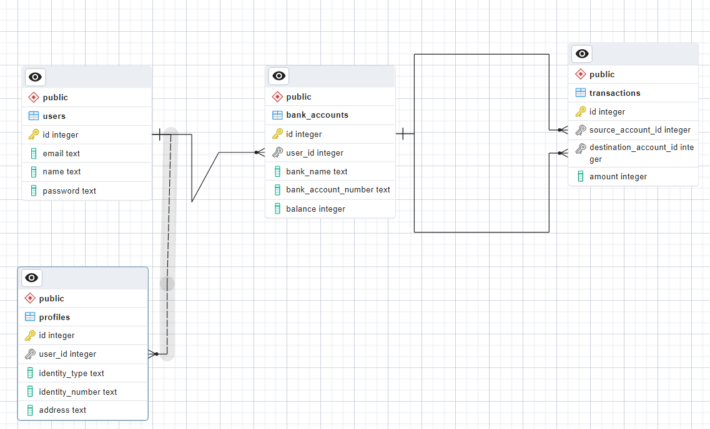

# API Basic Banking System

Challenge 5 - Membuat REST API Basic Banking System - MSIB (Binar Academy) - BACK END JAVASCRIPT - With AI Literacy & Global

## Teknologi Yang digunakan

- Node.js
- Express.js
- Prisma ORM
- PostgreSQL (Database)
- Bcrypt (Hashing Password)

## Database

